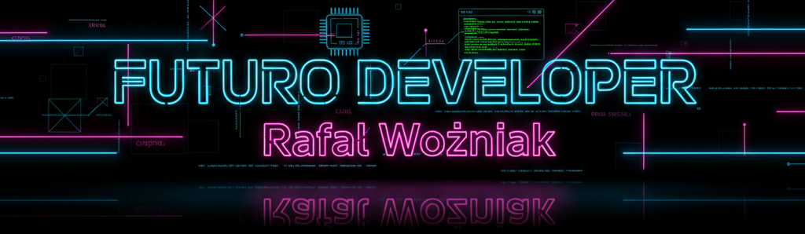

<h1 align="center"> Hola, soy Rafita, futuro Developer 👋</h1>

Estudiante de Desarrollo de Aplicaciones Multiplataforma (DAM) en proceso de reconversión profesional hacia el desarrollo web y móvil. Apasionado por la programación, la automatización y las soluciones tecnológicas prácticas. En este perfil encontrarás proyectos académicos, ejercicios de aprendizaje y herramientas que reflejan mi evolución como futuro desarrollador multiplataforma. 

      
Lenguajes utilizados y en proceso de aprendizaje

 
 
 
 
 

            

            

<!--
**RafitaFuenla/RafitaFuenla** is a ✨ _special_ ✨ repository because its `README.md` (this file) appears on your GitHub profile.

Here are some ideas to get you started:

- 🔭 I’m currently working on ...
- 🌱 I’m currently learning ...
- 👯 I’m looking to collaborate on ...
- 🤔 I’m looking for help with ...
- 💬 Ask me about ...
- 📫 How to reach me: ...
- 😄 Pronouns: ...
- ⚡ Fun fact: ...
-->
### ⚙️ &nbsp;GitHub Analytics

 

